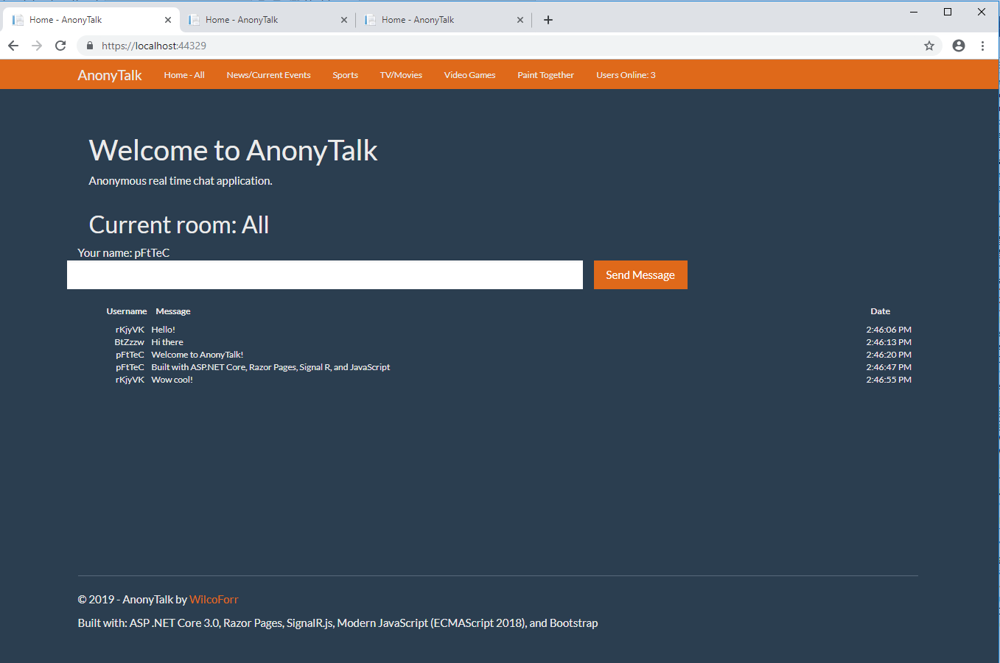
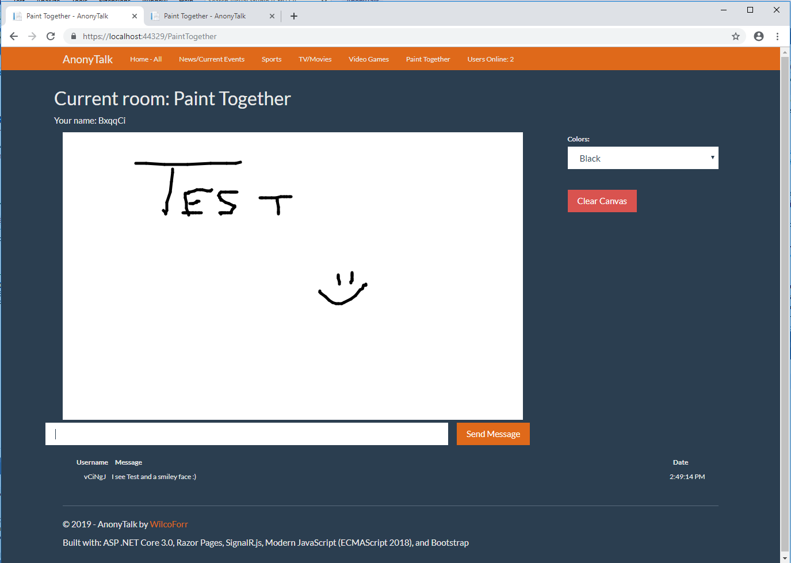

# AnonyTalk

An anonymous real time web chat with C#, ASP .NET Core 2.1, SignalR, and modern JavaScript (ECMAScript 2018).

Features:
- A few chat rooms - All, News, Sports, TV/Movies, Video Games
- "Paint Together" page, where users can draw and see another user's drawing/painting on the same page in real time.
- Users Online - a count of users online that increments or decrements whenever someone connects or disconnects

## Bugs

Sometimes when closing a tab in Chrome, IIS (at least IIS Express) crashes. Note sure if this bug would affect a live deployment to Azure.

## To Dos

- Host in Azure
- Rate limit message sending. Currently, a user can just spam messages.
- Security - not sure if someone can make chats with XSS or embed JavaScript. Might need to encode chat messages better, or maybe SignalR/ASP.Core handles that.
